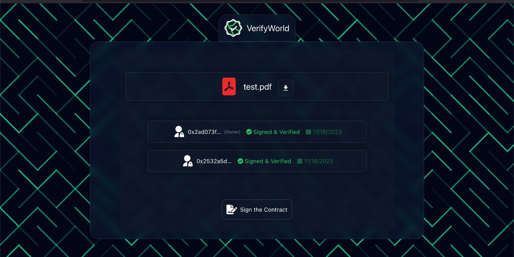

# VerifyWorld ✅ - Document Signing DApp with World ID Signatures

 

## 📖 About The Project

VerifyWorld is a document signing Decentralized Application (DApp) that harnesses the power of World ID signatures for user identity verification. With the help of Filecoin Labs' IPFS, users can easily upload their documents and share signing links with others. Our project seamlessly integrates the Cartesi Rollup SQLite database to securely store verification signatures.

The application's functionality is designed to be user-friendly. Here's how it works:

1. The document owner uploads and signs the document.
2. The owner shares the signing link with other users.
3. Other users can view existing signers or sign the contract themselves.

To illustrate a real-life scenario, consider hiring a freelancer from another country. Instead of dealing with complex e-signature platforms, VerifyWorld simplifies the process by allowing users to sign documents or data using World ID, ensuring a streamlined and secure experience.

### 🌟 Project Development Progress

VerifyWorld is developed in the ETHGlobal Istanbul Hackathon held at the ICC Istanbul Congress Center from 17th to 19th November 2023 as part of ODTÜ Blockchain.

### 🤝 Team

- **Tarık Kızıltan:** dApp back-end (Python, Cartesi Rollups, SQlite, IPFS...)
- **Burak Toy:** React back-end configurations and setting up fundamental infrastructures of the front-end
- **Hüseyin Karataş:** Front-end/UI development with React and TailwindCSS

 

## 🚀 Features

- Document signing with World ID signatures.
- Secure storage of verification signatures using Cartesi Rollup SQLite.
- User-friendly interface for document owners and signers.
- Sharing of signing links.
- Responsive design using React.js, Tailwind CSS, and traditional CSS for an engaging user experience.

 

## 🛠️ Technologies Used

- Python
- WorldID
- IPFS (InterPlanetary File System)
- Cartesi Rollup SQLite
- React.js
- Tailwind CSS

  

  

  

  

